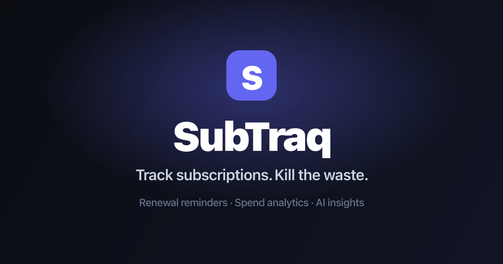

# 💸 SubTraq - Subscription Tracker

Track every subscription, see where your money goes, and cut the waste. SubTraq is a premium dashboard for recurring payments, renewal reminders, spend analytics, multi-currency totals, and AI-powered cancellation suggestions.

Try it instantly as a **guest** (data stays on your device), or **sign in** to sync across
devices.

**Live demo:** https://subtraq.yodkwtf.com



## Tech stack

- **Next.js 15** (App Router) + **TypeScript**
- **Tailwind CSS v3** with Radix-based, shadcn/ui-style primitives
- **Zustand** (`persist`) for client state and guest storage
- **Supabase** for auth + per-user cloud sync (optional)
- **Recharts** for spend charts, **Framer Motion** for motion, **date-fns** for renewal math
- **Google Gemini** (free-tier REST API) for AI insights, Q&A, and add-form auto-fill

## Getting started

1. **Install and run**

   ```bash
   npm install
   npm run dev
   ```

   Open [http://localhost:3000](http://localhost:3000) and click **Continue as guest** to
   explore with sample data - no keys or setup required.

2. **(Optional) Enable AI and real accounts.** Copy the example env file and fill in only
   the values you want:

   ```bash
   cp .env.example .env.local
   ```

   | Variable                                                            | Enables                                     | Where to get it                                                  |
   | ------------------------------------------------------------------- | ------------------------------------------- | ---------------------------------------------------------------- |
   | `GEMINI_API_KEY`                                                    | AI Insights, Ask AI, add-form auto-fill     | [aistudio.google.com/apikey](https://aistudio.google.com/apikey) |
   | `NEXT_PUBLIC_SUPABASE_URL` + `NEXT_PUBLIC_SUPABASE_PUBLISHABLE_KEY` | Real accounts + cloud sync + Google sign-in | Supabase → Connect (or Settings → API + API Keys)                |
   | `NEXT_PUBLIC_SITE_URL`                                              | Absolute SEO / Open Graph URLs              | your deployed domain                                             |

   Restart the dev server after editing `.env.local`. The full walkthrough (Supabase table,
   Row Level Security SQL, Google OAuth, email confirmation) is in **[guide.md](./guide.md)**.

## Features

- **Landing page** - public marketing page; every app route sits behind it.
- **Auth** - email/password and **Google** sign-in via Supabase, plus one-click **guest mode** with sample data.
- **Dashboard** - hero stats, color-coded upcoming renewals, recent activity, AI panel, quick-add.
- **Subscriptions** - fuzzy search, searchable category picker, filters, sort, grid/list toggle, and a slide-over with full CRUD + pause/resume/archive. Duplicate names are blocked.
- **Analytics** - a real 12-month spend trend, category donut, billing cadence, "most expensive" and "longest held".
- **Multi-currency** - each subscription is stored in the currency you enter it in; every amount on screen is converted to your default currency using live FX rates (`/api/fx`, cached, with an offline fallback), so totals and per-item amounts always read in one currency.
- **AI (Google Gemini, server-side)** - cancellation **Insights**, free-form **Ask AI**, and **auto-fill** of category + billing cycle when adding a subscription.
- **Renewal reminders** - optional browser notifications for renewals within your threshold.
- **PWA** - installable, with a maskable icon set and an offline service worker.
- **Settings** - display name, account info, default currency (14 currencies with SVG flags that render on every OS, INR by default), reminder threshold, notification toggle, JSON import/export, and clear-all. Every change confirms with a toast.
- **Brand logos** - 160+ colored Simple Icons plus uncolored react-icons fallbacks, with distinct marks per sub-brand.

## Data & sync

- **Guests** use `localStorage` (Zustand `persist`) - data stays on the device.
- **Signed-in users** get their dataset stored as a single JSON row in Supabase, protected by
  Row Level Security, loaded on sign-in and saved (debounced) on change.
- With no Supabase keys, the app runs cleanly in guest-only mode.

## Deploy

The repo includes a `netlify.toml` - importing it into Netlify is enough to build and deploy.
Add your env vars in **Site settings → Environment variables**, and set `NEXT_PUBLIC_SITE_URL`
to your domain so Open Graph/SEO links are absolute. See [guide.md](./guide.md) for the full
deployment checklist.

## Project structure

```
app/          landing (/), login, (app) protected routes, api (ai-*, fx), manifest/robots/sitemap
components/   auth, layout, dashboard, subscriptions, analytics, ai, ui (primitives)
lib/          types, constants, utils, store, supabase, cloud, fx, brand resolution
hooks/        useSubscriptions, useSpendSummary, useDisplayCurrency
```

See **[guide.md](./guide.md)** for full setup and deployment instructions.
